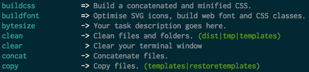

# grunt-available-tasks



[][ci] [][npm] [][deps] [][cc]

Want all of your registered tasks in a nice, alphabetized, colour coded list?
Think the task list outputted by `grunt --help` could be more descriptive?
`grunt-available-tasks` to the rescue!

## Install

Install via [npm](https://npmjs.org/package/grunt-available-tasks):

```
npm install grunt-available-tasks --save-dev
```

## Example

```js
module.exports = function(grunt) {
    grunt.initConfig({
        availabletasks: {           // task
            tasks: {}               // target
        }
    });

    grunt.loadNpmTasks('grunt-available-tasks');
    // Now run the command below on the command line to get your tasks list:
    // grunt availabletasks
};
```

If you want some further customisation, the options are as follows:

## Options

### options.tasks
Type: `Object`
Default value: `false`

The list of tasks to either include or exclude with the filter option.

### options.filter
Type: `String`
Default value: `false`

Define either 'include', or 'exclude'. The filter configuration will override
the group, description and sort configurations; so if you have filtered out a
task it will not show up in any groups, it won't receive a custom description
and it won't appear at the top of your task list. An example configuration:

```js
availabletasks: {
    tasks: {
        options: {
            filter: 'include',
            tasks: ['availabletasks', 'default']
        }
    }
}
```

### options.showTasks
Type: `Array`
Default value: `['single', 'multi', 'user']`

Use this option if you would like to show only a subset of the task types. For
example if you just want to show the tasks that you have written:

```js
availabletasks: {
    tasks: {
        options: {
            showTasks: ['user']
        }
    }
}
```

### options.groups
Type: `Object`
Default value: `{}` (empty)

You may choose to group similar tasks if you'd like; note that the same task can
appear in multiple groups if you wish. An example configuration:

```js
availabletasks: {
    tasks: {
        options: {
            groups: {
                'Run code validation tasks': ['lintspaces', 'jshint', 'jscs']
            }
        }
    }
}
```

### options.descriptions
Type: `Object`
Default value: `{}` (empty)

Override any task name, including aliases, with any description that you like.
An example configuration:

```js
availabletasks: {
    tasks: {
        options: {
            descriptions: {
                'availabletasks': 'A powerful task list helper for Grunt enabled projects.'
            }
        }
    }
}
```

### options.sort
Type: `Boolean|Array`
Default value: `true`

Setting this to `false` will maintain the original sort order for the tasks.
`true` will sort alphabetically, and specifying an array will allow you to do
your own custom sorting. An example configuration:

```js
availabletasks: {
    tasks: {
        options: {
            sort: ['lintspaces', 'availabletasks']
        }
    }
}
```

### options.hideUngrouped
Type: `Boolean`
Default value: `false`

Setting this to `true` will not output any tasks that haven't
been assigned to a group. `false` will display ungrouped tasks.
An example configuration:

```js
availabletasks: {
    tasks: {
        options: {
            hideUngrouped: true
        }
    }
}
```

### options.reporter
Type: `String|Function`
Default value: `default`

Choose either the default reporter (`default`) or the Markdown reporter
(`markdown`). Alternately, you can pass a `function` to this option if you'd
like to specify a custom reporter. A simple reporter could look like this:

```js
availabletasks: {
    tasks: {
        options: {
            reporter: function(options) {
                grunt.log.writeln(options.currentTask.name);
            }
        }
    }
}
```

In this function you are expected to handle group headings and how you'd like
the multi task targets to be displayed. The options object that is passed will
look something like this:

```js
{
    currentTask: {
        name: 'availabletasks',
        type: '=>',
        info: 'List available Grunt tasks & targets.',
        group: 'Ungrouped'
    },
    meta: {
        taskCount: 2,
        groupCount: 0,
        header: 'Ungrouped', // Only passed when the group has changed
        longest: 14 // The length of the longest task, useful for column padding.
    }
}
```

See the [reporters.js](lib/reporters.js) file for the default reporters, which
you can take and customise to your liking.

## Output

From left to right, this plugin outputs the task name, the type of the task,
then the description and finally a list of multitask targets should you have
configured two or more. The type of the task is registered with arrows:

* `  > ` denotes a single target task.
* ` -> ` denotes a multi target task.
* ` => ` denotes a user defined task.

## Contributing

Pull requests are welcome. If you add functionality, then please add unit tests
to cover it.

## License

MIT © [Ben Briggs](http://beneb.info)

[cc]:      https://codeclimate.com/github/ben-eb/grunt-available-tasks
[ci]:      https://travis-ci.org/ben-eb/grunt-available-tasks
[deps]:    https://gemnasium.com/ben-eb/grunt-available-tasks
[npm]:     http://badge.fury.io/js/grunt-available-tasks
